{: .entry-title }
# “cep by cep”

## mais… ils sont où ces vignerons ?

une année sept jours sur sept
et que je te coupe, et que je te laboure, et que je t’effeuille, et que je t’y parle, et que je te soigne, et que je te taille en gobelets ou en guyot
elle aime bien se faire dorloter et se laisser caresser par les doux rayons du soleil, mais il lui faut aussi un peu de pluie, mais pas trop
la journée vous les ne voyez pas, ils sont courbés dans leur vigne et disparaissent derrière les bois et les feuilles
et le week-end ils sont dans les caveaux à votre disposition
quand on longe les vignes, on ne voit personne sauf par temps de pluie où quelques points jaunes ou rouges te signalent qu’il y a un vigneron tout près dedans
c’est vrai que pour le commun des mortels le vigneron regarde sa vigne pousser, mûrir ses raisins, déguste ses vins et vend ses bouteilles… bref il se les roule sauf les soirs d’orage et de grêle ou quand il chasse la *suzuki*
…et pis il y a les vendanges !

ben c’est pas si simple
bien au contraire le travail de la vigne est très exigeant et demande beaucoup d’efforts d’autant que très souvent les machines sont exclues sauf à dos d’homme
tous les jours, il faut la visiter, l’ausculter, la soigner, lui parler, la surveiller et même parfois l’engueuler !

## du grain au verre

### [mercredi 8 février 2017](#mercredi-8-février-2017)

<a href="../images/cep-by-cep/2017-02-08.jpg">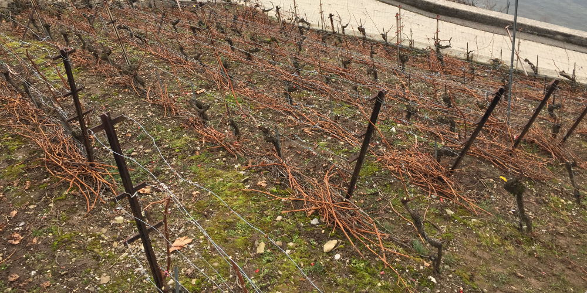</a>

tout est gris
personne dans la rue
un bruit d’enfer un tracasset qui se met à l’abri
il fait froid il pleuvine
une porte grince, la cave est presque vide
les tonneaux semblent heureux de nous voir
on prend la sonde et on prélève un peu du travail accompli
…et c’est là que l’on peut enfin savoir

### [vendredi 10 février 2017](#vendredi-10-février-2017)

<a href="../images/cep-by-cep/2017-02-10.jpg">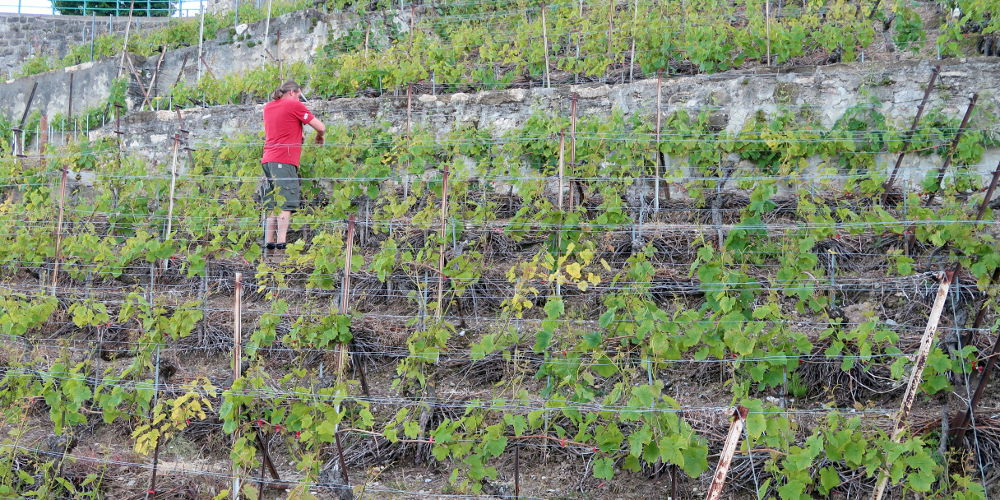</a>

premiers travaux dans le **charmus** mis à ma disposition par *didier imhof* ([cf. blog du 10.01.2017](../blog/rivaz-cave-des-dolles/)) domaine des *dolles* à *saint-saphorin* au lieu-dit *les fosses*
*didier* pratique la taille en **guyot** (cela consiste à laisser un seul sarment qui sera le porte-fruit lors du palissage) et un peu en **gobelet** (échalas)
il coupe les vieux sarments, j’enlève les bois, on nettoie les branches à fruits, on **palisse**
pas facile de plier les bois faut faire attention à ne pas les casser lorsqu’on les attache sur le fil porteur avec une espèce d’agrafeuse-dérouleuse de ruban

### [mardi 11 avril 2017](#mardi-11-avril-2017)

<a href="../images/cep-by-cep/2017-04-11.jpg">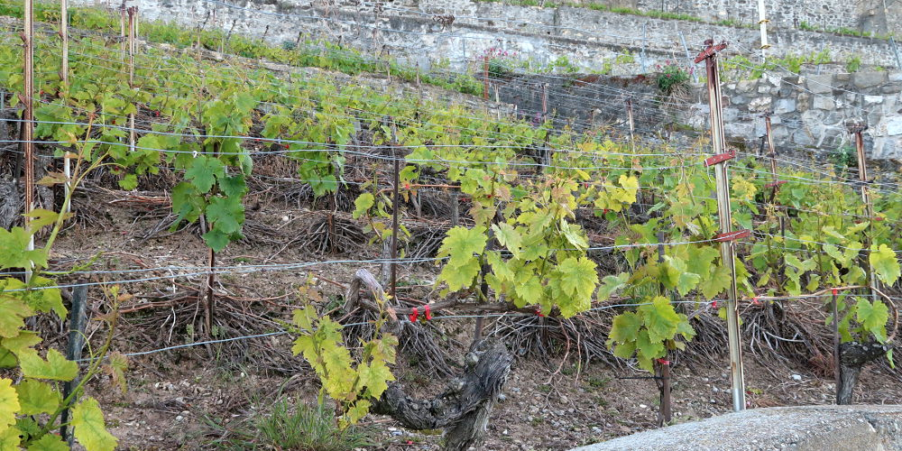</a>

depuis ma dernière visite, la vigne n’est pas restée seule de nombreux travaux ont été accomplis par le vigneron : arracher les ceps morts, les remplacer par de jeunes pousses, désherber, renforcer les murs
la vigne a **pleuré** à fin mars, elle a de l’avance cette année (écoulement de la sève au bout des sarments coupés)
profitant de ces premiers jours de beaux il est décidé d’**épianer** la vigne c’est-à-dire d’enlever des bourgeons sur la branche à fruits pour en laisser quatre et deux yeux sur le **courson** de réserve (on laisse deux petits bouts de sarments de l’an passé)

### [jeudi 20 avril 2017](#jeudi-20-avril-2017)

<a href="../images/cep-by-cep/2017-04-20.jpg">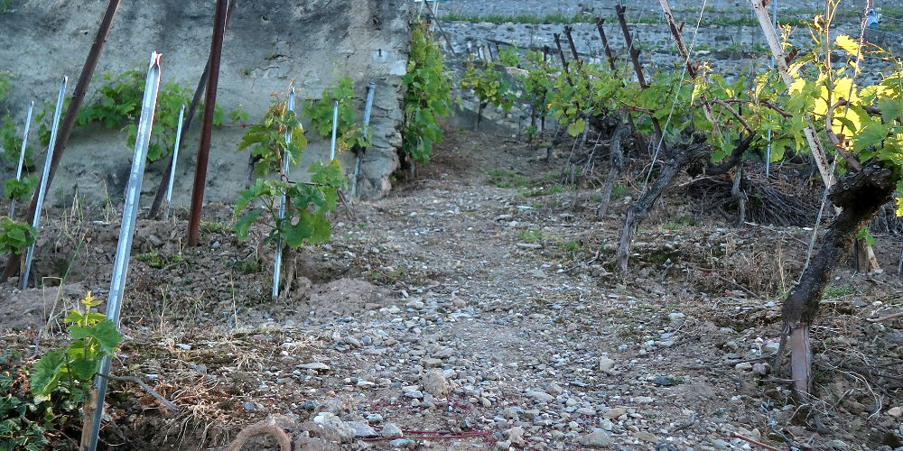</a>

le gel, inattendu, fait souffrir la vigne, surtout en valais et à genève où de nombreux vignerons ont perdu leur récolte
heureusement pas de dégâts du côté de *saint-saph*
à tous malheurs, il y a quelque chose de bon dit-on : le froid a freiné la croissance de la vigne un peu prématurée cette année

### [mercredi 3 mai 2017](#mercredi-3-mai-2017)

<a href="../images/cep-by-cep/2017-05-03.jpg">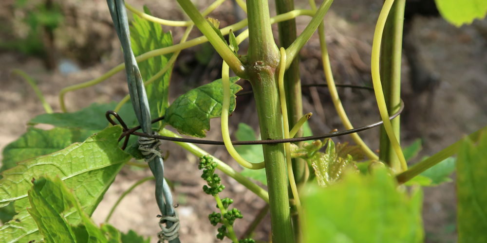</a>

on attache les jeunes sarments aux fils porteurs cette opération sera renouvelée dans quinze jours et suivie régulièrement tant que la vigne pousse
avec la sécheresse, la vigne a eu soif, elle n’est pas la seule d’ailleurs, on a dû arroser principalement les jeunes pieds

### [lundi 15 mai 2017](#lundi-15-mai-2017)

<a href="../images/cep-by-cep/2017-05-15.jpg">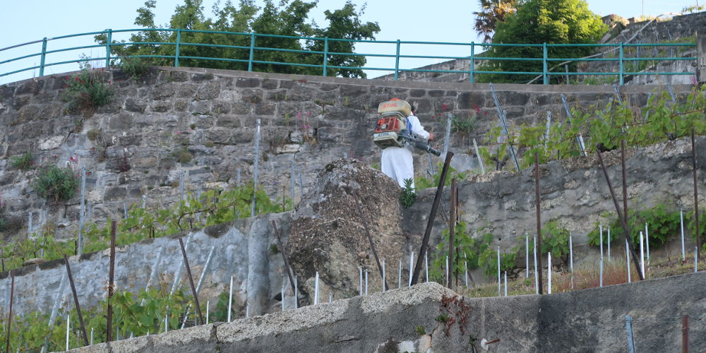</a>

telle une abeille, le vigneron va de cep en cep
on entend le bourdonnement de la machine qui applique le traitement contre le **mildiou** et l’**oïdium** et avec une oreille attentive, on entend plusieurs abeilles mais on les voit pas
les coteaux ont changé de manteau : du brun pour la pluie, ils ont mis le loden vert
on attache les sarments qui ont poussé depuis la dernière fois

### [mardi 22 mai 2017](#mardi-22-mai-2017)

on refait un tour pour attacher les sarments qui ont poussé depuis la semaine passée : impressionnant
la semaine prochaine il faudra rebioler, entretemps, place à l’atomiseur

### [lundi 29 mai 2017](#lundi-29-mai-2017)

<a href="../images/cep-by-cep/2017-05-29.jpg">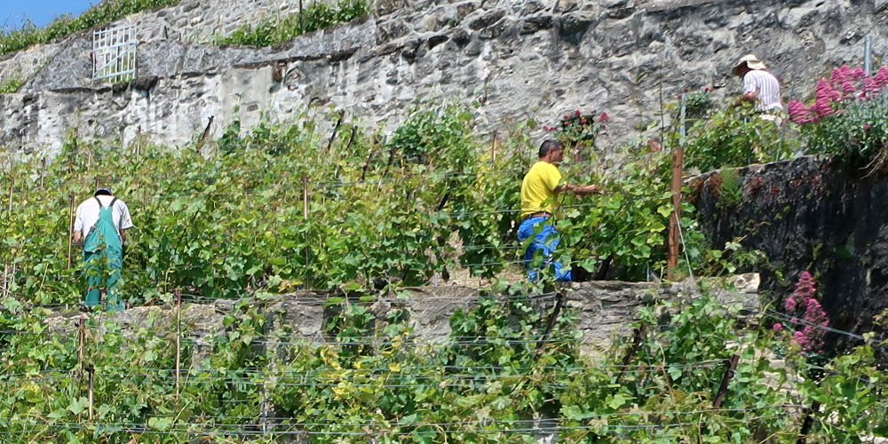</a>

il est 7 heures le soleil est levé mais ne chauffe pas encore le vignoble de *saint-saph* aujourd’hui on reboile, c’est-à-dire qu’on enlève les rebiots
bon, un rebiot est un bourgeon plus ou moins grand qui a poussé et s’est développé sur le sarment on enlève ceux-ci entre les grappes et le début du sarment
dure, dure… t’as le dos qui siffle
le long des murs les fleurs du merlot ont éclos

### [mardi 6 juin 2017](#mardi-6-juin-2017)

<a href="../images/cep-by-cep/2017-06-06.jpg">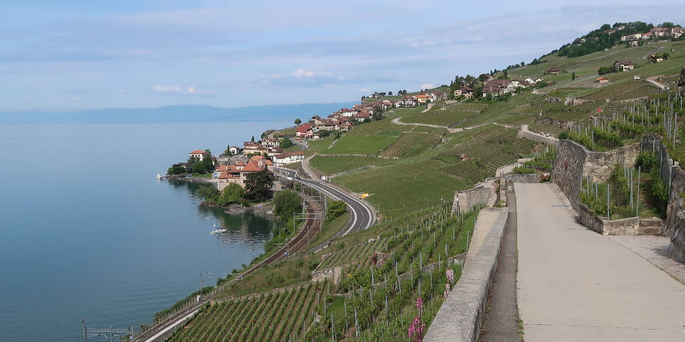</a>

après un week-end de la *pentecôte* avec des orages et des rayons de soleil, nous revoilà au pied du charmus
il faut rebioler et attacher les sarments qui ont poussé
la vigne a depuis quelque temps retrouvé sa vigueur et son ardeur qui nous motive sous une roille terrible d’autant plus effrayante qu’il fait presque nuit bien qu’on soit près des quatre chiffres ! trempés comme des soupes, on est bien content du travail accompli de nombreuses grappes portent déjà des fruits et que la **coulure** est faible (*en passant la petite grappe dans la main, seuls les fruits restent accrochés et des petits bouts de capuchons, d’étamines ou de pistils tombent et forment la coulure*)

### [mardi 20 juin 2017](#mardi-20-juin-2017)

<a href="../images/cep-by-cep/2017-07-04-grappe-01.jpg">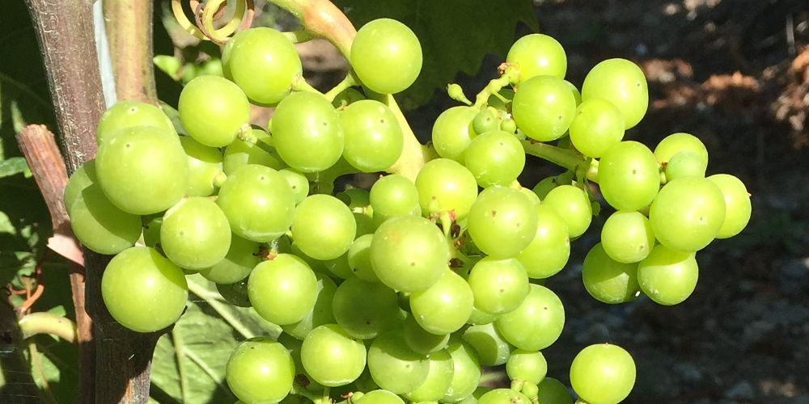</a>

avec les sauts d’humeur de la météo des ces derniers jours les différents traitements sont difficiles à programmer ceux-ci demandant un temps sec durant deux ou trois jours
mais la vigne adore ces écarts de température et surtout la pluie même orageuse lui a permis de s’épanouir
on profite des passages entre les ceps pour attacher les sarments afin de les maintenir et de les diriger en hauteur pour faciliter le passage pour les prochaines visites

<a href="../images/cep-by-cep/2017-07-04-attache.jpg">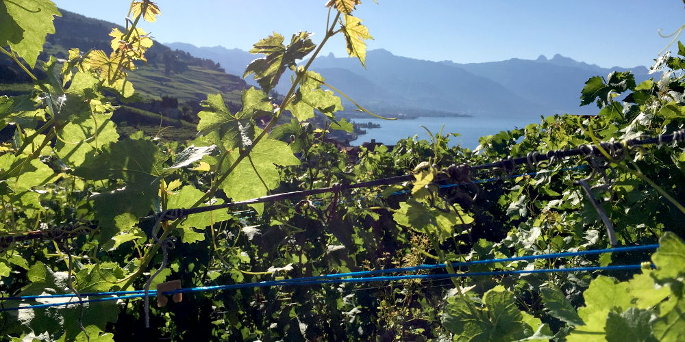</a>

### [jeudi 20 juillet 2017](#jeudi-20-juillet-2017)

<a href="../images/cep-by-cep/2017-07-12egrappage.jpg">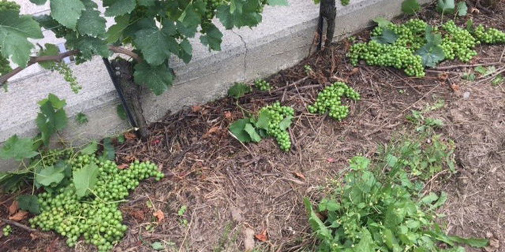</a>

on assiste à la **fermeture des grappes** c’est quand les grains se touchent, tellement ils ont grossi
on pratique **l’égrappage** c’est-à-dire que l’on coupe des grappes pour n’en laisser qu’une sur chaque sarment
on a chaud, la vigne aussi et il faut faire attention aux **coups de soleil** ou jaunissement des feuilles et dessèchement des **rafles** ou **manches** petits rameaux qui relient les grains et la grappe
on a eu un peu de grêle *aux fosses* à *saint-saph* heureusement pas trop grave, mais cela mérite surveillance

<a href="../images/cep-by-cep/2017-07-12grele2.jpg">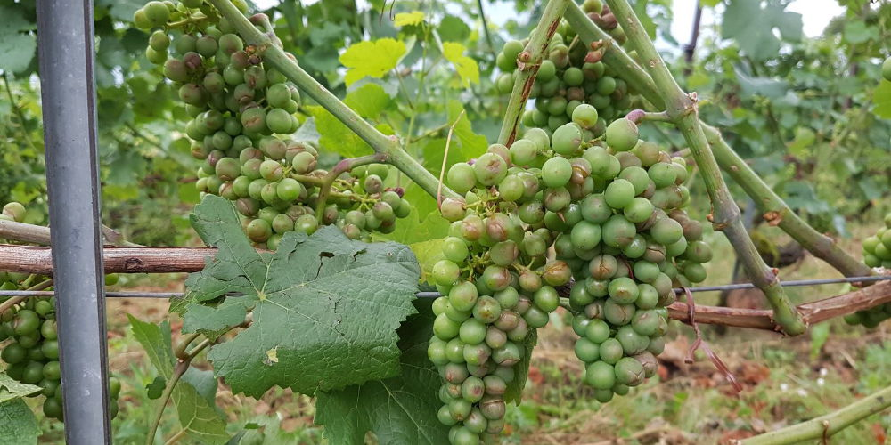</a>

### [dimanche 20 août 2017](#dimanche-20-août-2017)

<a href="../images/cep-by-cep/2017-08-20veraison.jpg">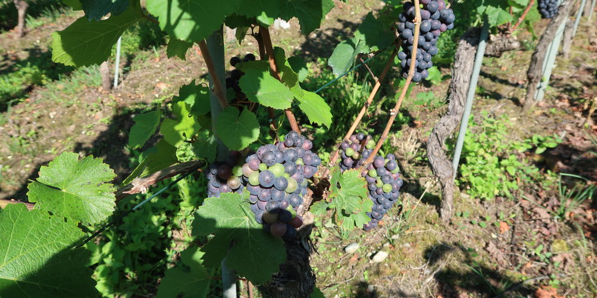</a>

on enlève les feuilles des branches
la veraison – *période où les baies virent au rouge* – est bien avancée, comme le sera la période des vendanges
on égrappe afin de conserver une grappe par sarment et on finit les traitements, notamment avec la bouillie bordelaise – *composée de sulfate de cuivre et de chaux* – de couleur bleu turquoise
l’hélicoptère fait ses dernières rondes, on laisse la nature faire son travail, mais celui du vigneron est loin d’être fini

<a href="../images/cep-by-cep/2017-08-20helico.jpg">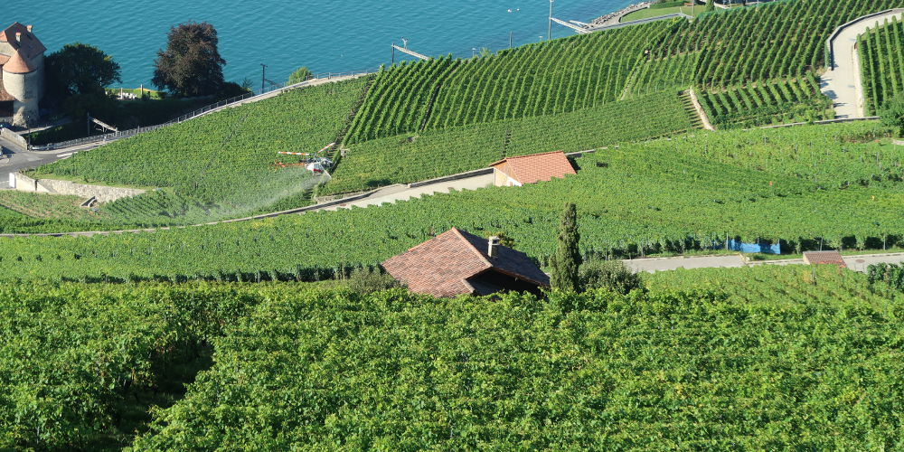</a>

### [mercredi 20 septembre 2017](#mercredi-20-septembre-2017)

<a href="../images/cep-by-cep/2017-09-20chariot-1000x500.jpg">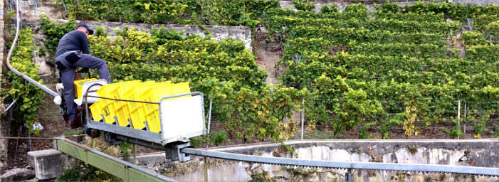</a>

déjà quelques flocons se sont posés sur le haut du *gramont*
à quelques jours des vendanges, la fièvre monte alors que la température nous rappelle que nous sommes bientôt en automne
il y a peu, on a enlevé les feuilles jaunies qui empêchent *jean rosset* de déposer sa poudre d’or sur les grains dont l’embonpoint nous réjouit

<a href="../images/cep-by-cep/2017-09-20grappe20.09-1000x500.jpg">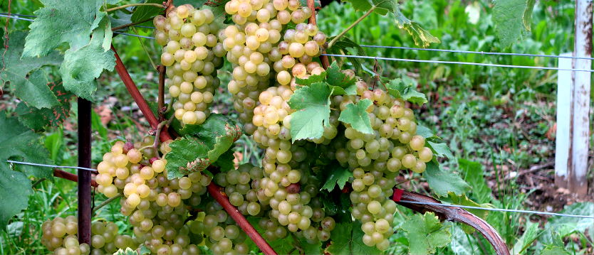</a>

les grappes de rouge ont enfilé leur habit blanc pour échapper à la *suzuki* qui voit que rouge

<a href="../images/cep-by-cep/2017-09-20rouge20-1000x500.jpg">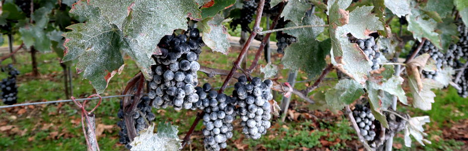</a>

le vigneron, pour cacher son inquiétude, consulte plus que d’habitude la météo sur son portable et prépare sa cave pour recevoir la vendange en nettoyant précautionneusement les cuves et le pressoir
ça doit être nickel pour accueillir le nectar

### [vendredi 20 octobre 2017](#vendredi-20-octobre-2017)

<a href="../images/cep-by-cep/2017-10-20fouloir2-1000x500.jpg">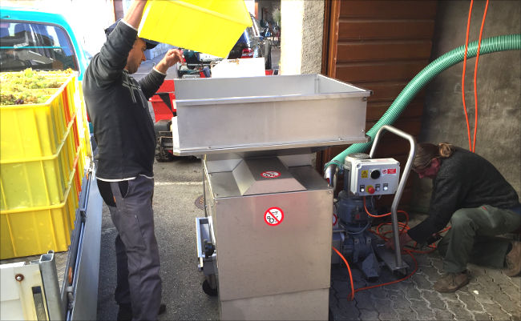</a>

les grappes de raisin blanc récoltées sont versées dans le **fouloir** et prennent le chemin du pressoir qui les transforme en moût qui sera mis en cuve

<a href="../images/cep-by-cep/2017-10-20moutpresse.1000x500.jpg">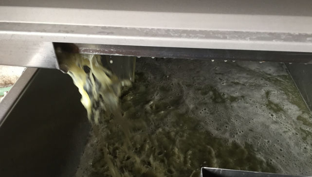</a>

on débourbe la cuve *(action de rendre le moût plus propre)* le moût est transféré
dans une autre cuve qui va recevoir des levures sélectionnées et naturelles qui vont
provoquer la **fermentation alcoolique** (FA)

<a href="../images/cep-by-cep/2017-10-20cuve1000x500.jpg">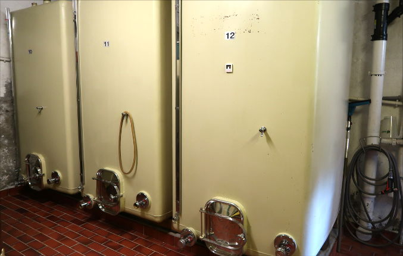</a>

les cuves sont surveillées régulièrement tous les jours ainsi que la température qui ne doit pas dépasser 13°C et cela peut durer cinq à six semaines
une fois terminée, on recape les cuves et on chauffe la cave à 20°C pour lancer la **fermentation malolactique** (malo)
en principe, la malo est terminée à fin décembre … enfin si le vin veut bien se mettre à travailler, période où l’on va abaisser la température de la cave à 0°C
… et ce sera la mise en bouteilles en général entre décembre et avril
… et enfin on pourra le déguster ce 2017

<a href="../images/cep-by-cep/2017-10-20cuverouge1000x500.jpg">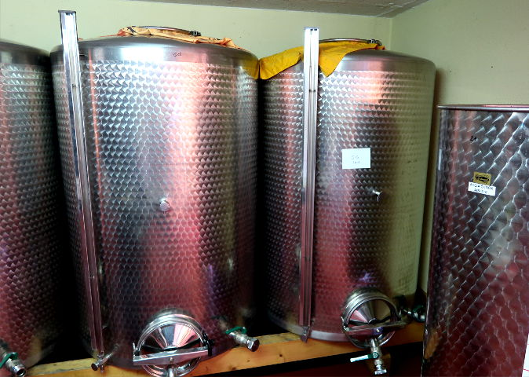</a>

pour le vin rouge, on égrappe et on met les grains dans le cuvage, accompagnés de levures sélectionnées et naturelles
après une semaine environ, on presse la masse et le jus attend durant une semaine dans une cuve pour permettre aux lies de se déposer sur le fond
puis soit ce moût reste en cuve, soit il passe en barriques
la cave est chauffée à 20°C durant six à huit semaines
et selon, après six, huit ou douze mois, voire dix-huit mois on passe à la mise en bouteille et en verres au carnotzet

<a href="../images/cep-by-cep/2017-10-20barrique1000x500.jpg">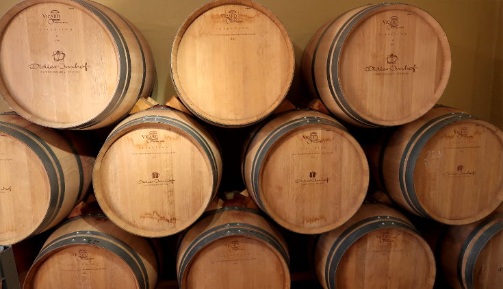</a>

durant tous ces jours de la grappe à la bouteille, le vigneron passera tout son temps à surveiller les cuves ou les barriques, vérifier la température ou soigner l’évolution de ce vin afin de mettre un point final à l’histoire du grain au verre !
… et pendant ce temps, la vigne se repose, s’endormira et repartira de plus belle… mais ça c’est l’histoire d’un *autre grain et d’un autre verre*
santé ! conservation et …dans quinze jours pour un nouveau blog

### [lundi 20 novembre 2017](#lundi-20-novembre-2017)

<a href="../images/cep-by-cep/2017-11-20couleur1000x500.jpg">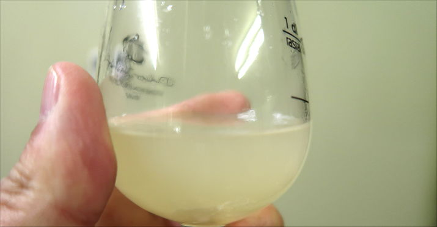</a>

de la cave au verre !
la vigne prend ses quartiers d’hiver
les chemins entre les charmus sont parcourus par de très nombreux promeneurs qui pris d’iphomaniaqueriephotos pour ce paysage aux reflets d’or, en oublient le labeur nécessaire à cette explosion de couleurs
c’est que maintenant dans l’antre de leur cave, ils sont préoccupés par l’explosion des saveurs

<a href="../images/cep-by-cep/2017-11-20miseenbouteille1000x500.jpg">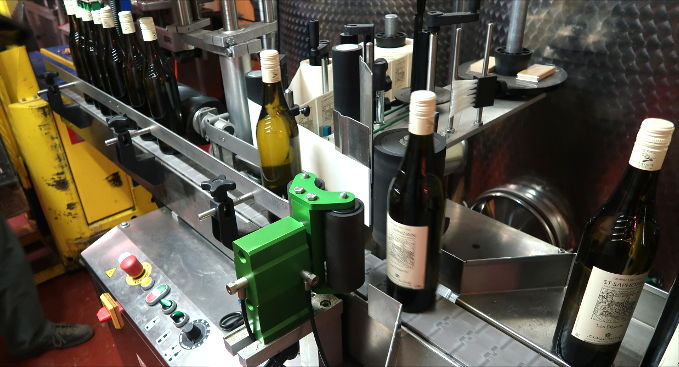</a>

le blanc a fini sa fermentation alcoolique après quinze jours de cuve
on chauffe la cave à 20°C pour aider au démarrage de la fermentation malolactique
tous les jours, il faut soutirer au robinet dégustateur (ou guillon s’il est en bois)
on vérifie du nez qu’il n’y a pas d’odeurs qui ne sont pas celles du raisin
en chutant la cuve (en aérant le vin par transfert dans une autre cuve ou en diffusant un peu d’oxygène dedans)
pendant ce temps, après chutage du rouge, celui-ci s’occupe et prend ses aises dans la cuve ou le fût, mais non sans surveillance régulière

pendant ce temps, la vigne s’endort

<a href="../images/cep-by-cep/2017-11-20vignerepos1000x500.jpg">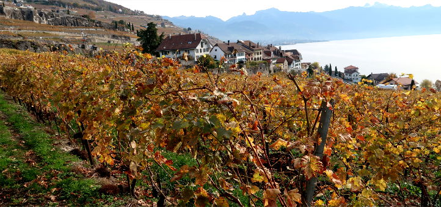</a>

### [mercredi 20 décembre 2017](#mercredi-20-décembre-2017)

<a href="../cep-by-cep/2017-12-20cataille1000x500.jpg">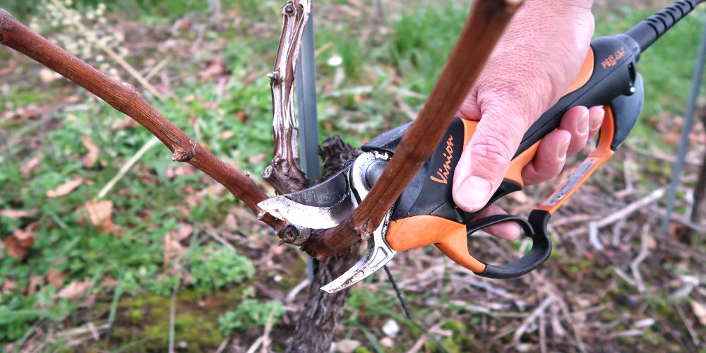</a>

on a refait les murs, on a remonté la terre
la **pré-taille** a été faite (on coupe le haut des sarments à la hauteur des fils) et on commence
la taille muni d’un secateur électrique
mais certains attendront janvier ou mars pour le faire
le cep taillé, on dirait une main qui sort de terre avec un doigt qui montre le ciel : c’est le
porte fruits qui sera palissé en mars
les sarments sont laissés à même le sol et serviront d’engrais

<a href="../cep-by-cep/2017-12-20cestcoupe1000x500.jpg">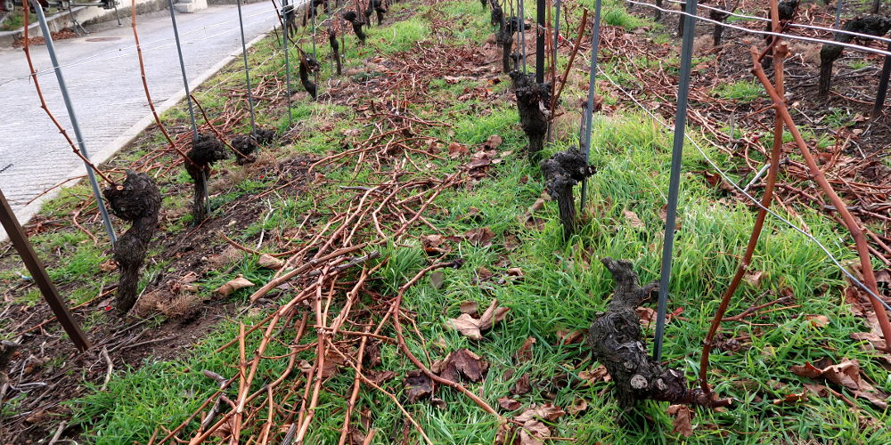</a>

plutôt que de se les geler dehors, le vigneron s’occupe dans sa cave maintenue à 20°
jusqu’à la fin de la malo
tous les jours on contrôle au nez **la franchise** des vins (on peut ainsi déceler les odeurs qui
n’ont rien à faire dans un verre) et on fait régulièrement une **chroma** (on
place deux gouttes de vin sur l’emplacement prévu  à cet effet sur le support de la
chromatographie et on observe la tâche jaune – si celle-ci se trouve en haut du graphe, la
malo est terminée – les numéros au bas correspondent aux cuves ou barriques)
puis, la température sera abaissée à zéro ce qui permet de stabiliser le vin
on est dans la dernière ligne droite…

<a href="../cep-by-cep/2017-12-20chroma1000x500.jpg">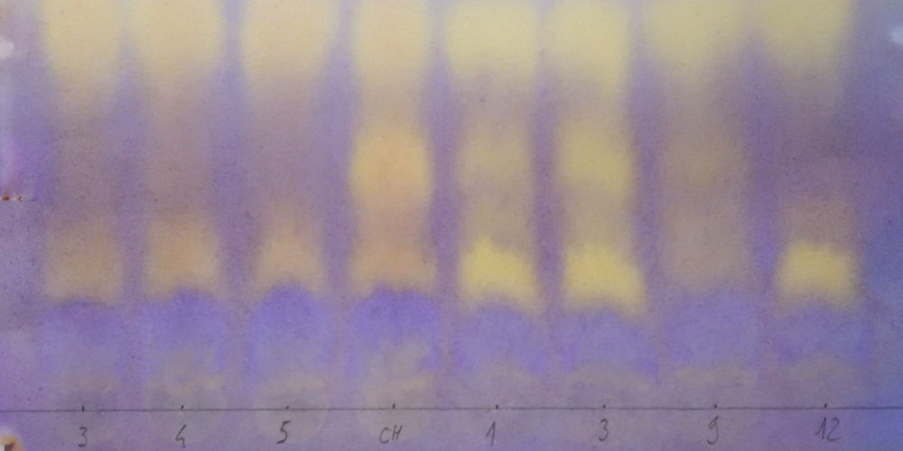</a>

pendant ce temps, la vigne dort

<a href="../cep-by-cep/2017-12-20paysage2-1000x500.jpg">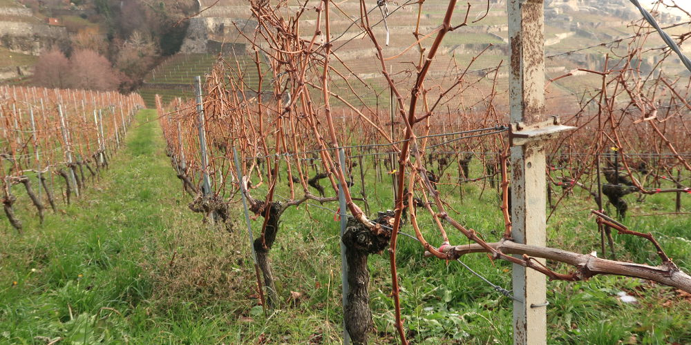</a>

{: .align-center }
❧
